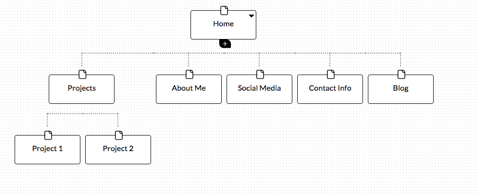

**What are the 6 Phases of Web Design?**
info gathering
planning
design
development
testing & delivery
maintenance

**What is your site's primary goal or purpose? What kind of content will your site feature?**
I'm not entirely sure about my site's purpose yet, other than it will be about me, my projects, my work, my life, etc. so it will feature lots of stuff about me. At this point, I do not know the intended audience (hiring managers? my family? DBC colleagues?)

**What is your target audience's interests and how do you see your site addressing them?**
See above, I don't know yet. I'm going to guess that the site will be potential hiring managers, so they will want to see what my skills are, what projects are in my portfolio, and a bit about my personality so they can assess if I will fit in.

**What is the primary "action" the user should take when coming to your site? Do you want them to search for information, contact you, or see your portfolio? It's ok to have several actions at once, or different actions for different kinds of visitors.**
I want them to take a quick look at the front page, determine if they want to learn more about me, and if so to go to my projects and to my about me page.

**What are the main things someone should know about design and user experience?**
1> design with the intended user in mind
2> keep it simple
3> both visual deisgn and information architecture are important

**What is user experience design and why is it valuable?**
UX is about how one feels when using a site. Ideally, the user enjoys the experience and performs whatever action the site owner wants (buy a widget, sign up for a free email, etc). If a site is confusing, or is hard to use, or its look and feel is a mismatch to the user, they are less likely to enjoy the site and to use it for the intended purpose.

**Which parts of the challenge did you find tedious?**
None, this is fun!