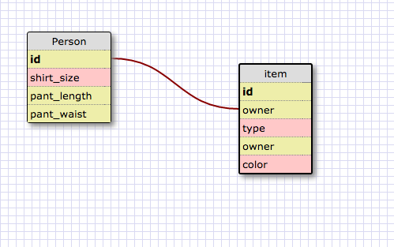

1. select * from states;
2. select * from regions;
3. select state_name, population from states;
4. select state_name, population from states order by population desc;
5. select state_name from states where region_id = 7;
6. select state_name, population_density from states where population_density > 50 order by population_density;
7. select state_name from states where population > 1000000 and population < 1500000;
8. select state_name, region_id from states order by region_id;
9. select region_name from regions where region_name like '%central';
10. select regions.region_name, states.state_name from regions inner join states on regions.id=states.region_id order by regions.id;

**clothing schema:**

**Reflections:**
**What are databases for?**
Storing, retrieving and manipulating data in a convenient and secure way.

**What is a one-to-many relationship?**
One to many means that one entity may have a relationship with any number of other entities (unlike one to one, like people and social security numbers).
For example, basketball teams would have a one-to many relationship with their players, since each team will have 12 players, but each player will have only one team (at a given time)

**What is a primary key? What is a foreign key? How can you determine which is which?**
A primary key is the unique identifier within a database, for example, a social security number or student ID #
for a person. A foreign key is when a field in a table is linked to a field in another table (usually that table's primary key)

**How can you select information out of a SQL database? What are some general guidelines for that?**
Using SQl syntax to query from the database. the syntax must select for the attributes (columns) from specific tables
Tables can be joined to create a new data objects that pull from more than one table, like #10 above.

