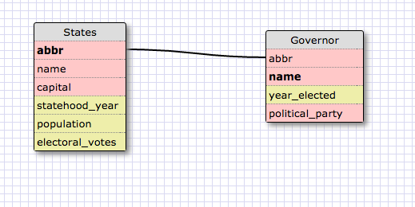
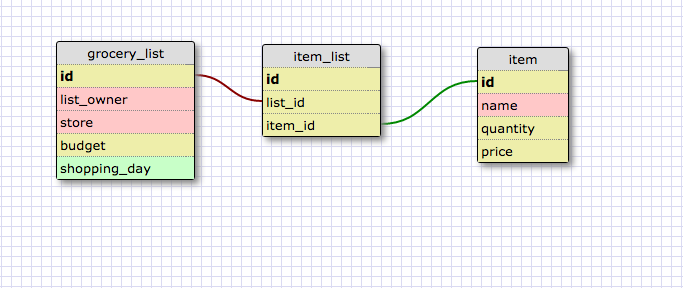

one-to-one:

many-to-many:

**What is a one-to-one database?**
A database where an entity of type 1 is associated with one and only one entity of type 2.

**When would you use a one-to-one database? (Think generally, not in terms of the example you created).**
When we want to associate different types of entites that have a one-to-one relationship in the real world.
For example - Team and Head Coach. Each team has one head coach, each head coach has only one team.
You could in theory put coach name, ss#, years of experience, salary etc under "team," but that would be messy,
especially if the "coach" item might have its own one-to-many relationships, such as "season win-loss record" or "titles won,"
it's better to split them into two separate categories.

**What is a many-to-many database?**
A database that maps relationships where each entity could be associated with multiple other entites.

**When would you use a many-to-many database? (Think generally, not in terms of the example you created).**
When the relationship is not exclusive in either direction. For example, a many-to-many relationship could be used to model languages and countries.
Some languages are used in more than one country (French is spoken in France and Belgium),
Some countries have more than one language (in Belgium, French and Dutch are spoken. )

**What is confusing about database schemas? What makes sense?**
Most of it makes sense. One thing I have not yet figured out yet is why the items in a join table must have an ID.
for the student~challenge join table (linking students and challenges), why must each student~challenge combo have an ID?
Why can't they just be associated together in a table without an ID?